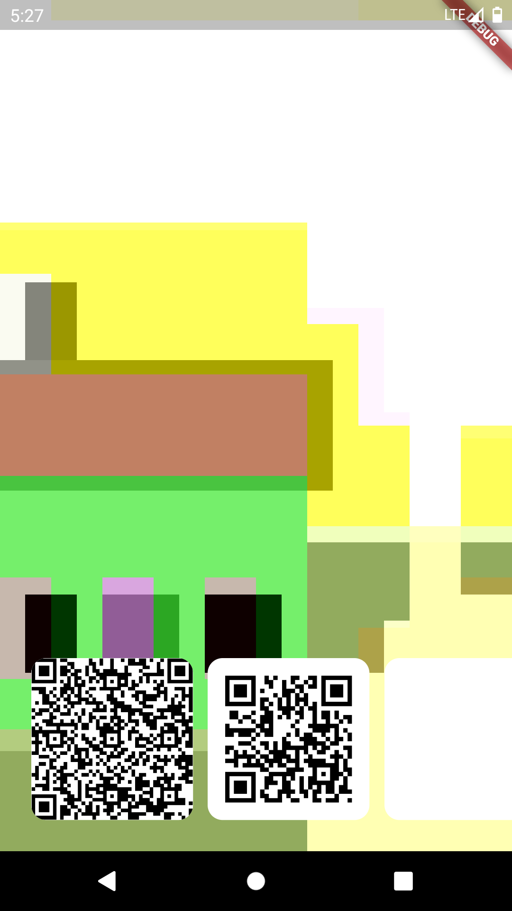

## 0.0.1

# Scanly
## Simple and Comprehensive QR Package.
### What can Package Do ?

- Generate QR Code with your data.
- Scan QR Via Camera.
- Scan QR Code From Recent Photos With Awesome UI or Pick from Gallery.

## Installation
### Android
android -> app -> build.gradle
```
minSdkVersion 22
```
android -> app -> src -> main -> AndroidManifest.xml
```
<uses-permission android:name="android.permission.CAMERA" />
<uses-permission android:name="android.permission.WRITE_EXTERNAL_STORAGE"/>
<uses-permission android:name="android.permission.READ_EXTERNAL_STORAGE"/>
```
```
<application
        android:requestLegacyExternalStorage="true"
                                          >
```

### iOS
ios -> Runner -> info.plist
```
<key>NSCameraUsageDescription</key>
<string>We Want camera access for QR Scanning</string>
<key>NSPhotoLibraryUsageDescription</key>
<string>We Want gallery access for QR Scanning</string>
```

## Usage

### Generate QR Code Widget
```
ScanlyQRGenerator(
  data: 'Scanly',
)
```


### Scan QR Widget Via Camera or Gallery
```
ScanlyQRScanner(
  onScanData: (data){
    log('QR Data: $data'); 
  },
)
```

